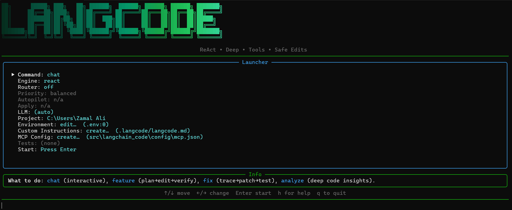

<p align="center">
  
</p>

<h1 align="center">LangCode</h1>
<p align="center">
  <em><font size="4">The only CLI you'll ever need!</font></em>
</p>

<p align="center">
  
</p>

LangCode is an AI-powered coding assistant designed to streamline your development workflow. Interact with your codebase, implement new features, fix bugs, and gain insights, all from a single, intuitive interface.

## Key Features

*   **Interactive Launcher:** Start with `langcode` and configure everything through a user-friendly interface.
*   **AI-Powered Code Understanding:** Deeply analyzes your code to answer questions and generate insights.
*   **Automated Coding Tasks:** Implements features, fixes bugs, and refactors code with minimal effort.
*   **Safe and Reviewable Changes:** Generates clear diffs for every modification, ensuring you stay in control.
*   **Multi-LLM Support:** Seamlessly integrates with Google Gemini and Anthropic Claude, intelligently routing to the best model for the task.
*   **Customizable Instructions:** Tailor the agent's behavior with project-specific rules and guidelines using `.langcode/langcode.md`.
*   **Extensible with MCP:** Integrate custom tools via Model Context Protocol (MCP).

## Get Started

1.  **Installation:**
    ```bash
    pip install langchain-code
    ```

2.  **Launch the Interactive Launcher:**
    Just type `langcode` in your terminal and hit Enter. This opens a user-friendly interactive menu where you can easily configure your session and access various functionalities without needing to remember specific command-line arguments. See the image shown above.


## Interactive Mode

The interactive mode serves as the central hub for all your coding tasks. It allows you to:

*   **Choose a Command:** Select what you want to do: `chat`, `feature`, `fix`, or `analyze`.
*   **Configure the Engine:** Pick between `react` (fast and efficient) and `deep` (for complex tasks).
*   **Enable Smart Routing:** Let LangCode automatically select the best LLM for each task.
*   **Set the Priority:** Optimize for `cost`, `speed`, or `quality` when using smart routing.
*   **Manage Autopilot:** Enable fully autonomous mode for the Deep Agent (use with caution!).
*   **Toggle Apply Mode:** Allow LangCode to automatically write changes to your file system.
*   **Select an LLM:** Explicitly choose between Anthropic and Google Gemini, or let LangCode decide.
*   **Specify the Project Directory:** Tell LangCode where your codebase is located.
*   **Edit Environment Variables:** Quickly add or modify API keys and other settings in your `.env` file.
*   **Customize Instructions:** Open the `.langcode/langcode.md` file to add project-specific guidelines.
*   **Configure MCP Servers:** Set up Model Context Protocol (MCP) servers for advanced tool integration.
*   **Edit Language Code:** Modify the core language code directly from the main window.
*   **Specify MCP Servers:** Configure Model Context Protocol (MCP) servers for advanced tool integration.
*   **Define a Test Command:** Specify a command to run after making changes (e.g., `pytest -q`).
*   **Access Help:** Press `h` to toggle help and `q` or `Esc` to quit.

## Core Commands

While the interactive launcher is the recommended way to use LangCode, you can also use the following commands directly from the terminal:

*   `langcode chat`: Starts an interactive chat session.
*   `langcode feature`: Implements a new feature.
*   `langcode fix`: Fixes a bug.
*   `langcode analyze`: Analyzes the codebase.
*   `langcode instr`: Opens the project instructions file.

See the "Commands" section below for more details.

## Slash Commands

You can use the following slash commands during a chat session:

*   `/clear`: Clears the chat history.
*   `/select`: Returns to the interactive launcher.
*   `/exit` or `/quit`: Ends the chat session.
*   `/help`: Displays a help message.
*   `/memory` or `/stats`: Shows memory and statistics about the current session (deep mode only).
*   `/env`: Allows you to create an environment if one doesn't exist.

## Configuration & Files

LangCode uses a few key files for configuration:

*   `.env`: Stores API keys and other environment variables. You can create and edit this file directly from the interactive launcher.
*   `.langcode/langcode.md`: Contains project-specific instructions for the agent. Edit this file to tailor LangCode's behavior to your codebase.
*   `.langcode/mcp.json`: Configures Model Context Protocol (MCP) servers for advanced tool integration.

## Command-Line Interface (CLI) and Usage

LangCode provides a set of commands to interact with your codebase. Here's a breakdown of each command and its usage:

### `langcode chat`

Starts an interactive chat session with the agent. This is useful for exploring the codebase, asking questions, and making scoped edits.

```bash
langcode chat [--llm <provider>] [--mode <react|deep>] [--auto] [--router] [--priority <balanced|cost|speed|quality>] [--project-dir <path>]
```

*   `--llm`: Specifies the LLM provider to use (anthropic or gemini). If not specified, LangCode will automatically select a provider based on availability and router policy.
*   `--mode`: Selects the reasoning engine to use: `react` (default) or `deep`. The `deep` mode enables more complex, multi-step reasoning.
*   `--auto`: (Deep mode only) Enables autopilot mode, where the agent plans and executes tasks end-to-end without asking for confirmation.
*   `--router`: Enables smart model routing, which automatically picks the most efficient LLM per prompt based on the specified priority.
*   `--priority`: Sets the routing priority: `balanced` (default), `cost`, `speed`, or `quality`. This influences the model choice when routing is enabled.
*   `--project-dir`: Specifies the project directory to operate in. Defaults to the current directory.

**Example:**
```bash
langcode chat --llm gemini --mode deep --auto
```
This command starts a chat session using the Gemini LLM in deep mode with autopilot enabled.

### `langcode feature`

Implements a feature end-to-end, following a plan -> edit -> verify workflow. This command is designed to automate the process of adding new features to your codebase.

```bash
langcode feature <request> [--test-cmd <command>] [--apply] [--llm <provider>] [--router] [--priority <balanced|cost|speed|quality>] [--project-dir <path>]
```

*   `<request>`: A description of the feature to implement (e.g., "Add a dark mode toggle").
*   `--test-cmd`: Specifies a command to run to verify the changes (e.g., `pytest -q`).
*   `--apply`: Applies the changes and runs the test command without prompting for confirmation.
*   `--llm`: Specifies the LLM provider to use (anthropic or gemini).
*   `--router`: Enables smart model routing.
*   `--priority`: Sets the routing priority.
*   `--project-dir`: Specifies the project directory.

**Example:**
```bash
langcode feature "Implement user authentication with JWT" --test-cmd "pytest -q" --apply
```
This command implements user authentication with JWT, runs the tests, and applies the changes without prompting.

### `langcode fix`

Diagnoses and fixes a bug, following a trace -> pinpoint -> patch -> test workflow. This command helps automate the process of fixing bugs in your codebase.

```bash
langcode fix <request> [--log <file>] [--test-cmd <command>] [--apply] [--llm <provider>] [--router] [--priority <balanced|cost|speed|quality>] [--project-dir <path>]
```

*   `<request>`: A description of the bug to fix (e.g., "Fix crash on image upload").
*   `--log`: Specifies the path to an error log or stack trace.
*   `--test-cmd`: Specifies a command to run to verify the fix.
*   `--apply`: Applies the changes and runs the test command without prompting for confirmation.
*   `--llm`: Specifies the LLM provider to use.
*   `--router`: Enables smart model routing.
*   `--priority`: Sets the routing priority.
*   `--project-dir`: Specifies the project directory.

**Example:**
```bash
langcode fix "Resolve memory leak in image processing module" --log memory_leak.log --test-cmd "pytest -q"
```
This command resolves a memory leak using the provided log file and runs the tests to verify the fix.

### `langcode analyze`

Analyzes the codebase and generates insights using the Deep Agent architecture. This command is useful for getting an overview of the project and understanding its architecture.

```bash
langcode analyze <request> [--llm <provider>] [--router] [--priority <balanced|cost|speed|quality>] [--project-dir <path>]
```

*   `<request>`: A question or request for analysis (e.g., "What are the main components of this project?").
*   `--llm`: Specifies the LLM provider to use.
*   `--router`: Enables smart model routing.
*   `--priority`: Sets the routing priority.
*   `--project-dir`: Specifies the project directory.

**Example:**
```bash
langcode analyze "Explain the data flow in the user authentication module"
```
This command analyzes the user authentication module and explains the data flow.

### `langcode instr`

Opens or creates the project-specific instructions file (`.langcode/langcode.md`) in your editor. This file allows you to provide custom instructions and guidelines for the agent to follow.

```bash
langcode instr [--project-dir <path>]
```

*   `--project-dir`: Specifies the project directory.

**Example:**
```bash
langcode instr
```
This command opens the `.langcode/langcode.md` file in your default editor.


## Reasoning Engines & Workflows


* `auto` – DEEP AUTOPILOT end‑to‑end execution
* `bug_fix` – guided diagnosis → patch → verify
* `feature_impl` – plan → small diffs → test → review

## Under the Hood

### Hybrid Intelligent LLM Router

A rule‑augmented, feedback‑aware router picks the right model for each task based on complexity, context size, latency, and cost. Use `--llm` to override.

#### Agent Architectures

## Agent architectures

### ReAct Agent

The ReAct Agent is a fast loop for chat, reads, and targeted edits. It follows the ReAct (Reasoning and Acting) framework, where the agent reasons about the current state, decides on an action, and then observes the result of that action. This process is repeated until the agent reaches a conclusion or the maximum number of iterations is reached.

### Deep Agent

The Deep Agent is a structured, multi-agent system for complex work. It uses a LangGraph-style architecture to execute multi-step, long-horizon tasks. The Deep Agent consists of several sub-agents, each responsible for a specific task, such as research, code generation, and Git operations.

* **ReAct Agent** – fast loop for chat, reads, and targeted edits.
* **Deep Agent** – structured, multi‑agent system for complex work:

  * `research-agent` – gathers local and web context
  * `code-agent` – generates minimal, verifiable diffs and runs tests
  * `git-agent` – stages changes and crafts commits

### Deep Agent state

* **Todos** – managed via `write_todos`
* **Virtual files** – stage edits safely before touching disk

### DEEP AUTOPILOT mode

Run fully autonomously with a single final report. Combine with tests for safe, end‑to‑end changes.

## Built-in Tools

* `list_dir`, `glob`, `grep` – fast project navigation
* `read_file`, `edit_by_diff`, `write_file` – safe, reviewable edits
* `run_cmd` – gated shell execution
* `process_multimodal` – text + image understanding in chat
* `write_todos` – persistent plan items for Deep Agent

## MCP integration

Extend LangCode with external capabilities using Model Context Protocol. Define servers in `~/.langcode/mcp.json` or `./.langcode/mcp.json`.

Example `mcp.json` snippet:

```json
{
  "servers": {
    "github": { "command": "mcp-github" },
    "search": { "command": "mcp-search" }
  }
}
```

Invoke tools naturally in chat or within Deep Agent plans once configured.

## Image support in chat

Use the `/img` directive to analyze images alongside your prompt:

```text
/img assets/screenshot.png :: What’s wrong with this UI?
```

## Safety and Control

* Preview all diffs and commands before execution
* Explicit confirmation gates by default
* `--apply` for non‑interactive runs
* Minimal diffs for clear reviews and quick rollbacks

## Examples

Summarize a repo:

```bash
langcode chat -p "Summarize this codebase and list risky areas"
```

Refactor with tests:

```bash
langcode feature "Switch user IDs to UUID" --test-cmd "pytest -q"
```

Patch from stack trace:

```bash
langcode fix --log crash.log --test-cmd "npm test"
```

Multi‑step change:

```bash
deepagent "Introduce feature flags with config, implement two flags, add tests"
```

## Troubleshooting & Debugging

* Run with `--verbose` to inspect tool calls and decisions
* Ensure provider keys are present in `.env`
* Narrow scope or provide `--include-directories` for large monorepos
* File an issue with a minimal reproduction

## Configuration

LangCode can be configured via environment variables and project-specific files. The following environment variables are supported:

* `ANTHROPIC_API_KEY`: API key for Anthropic Claude.
* `GOOGLE_API_KEY`: API key for Google Gemini.

Project-specific configuration files:

* `./.langcode/mcp.json`: Configuration for Model Context Protocol (MCP) servers.
* `./.langcode/`: Directory for project-specific context or defaults.

## Custom Tools

LangCode can be extended with custom tools using the Model Context Protocol (MCP). To create a custom tool, you need to define a server that implements the MCP protocol and register it in the `mcp.json` file. Once configured, you can invoke the tool naturally in chat or within Deep Agent plans.

## Contributing

Issues and PRs are welcome. Please open an issue to discuss substantial changes before submitting a PR. See `CONTRIBUTING.md` for guidelines.

## License

MIT. See [LICENSE](LICENSE).

## Acknowledgments

LangCode draws inspiration from the design and developer experience of Google’s Gemini CLI and Anthropic’s Claude Code, unified into a single, streamlined tool.
