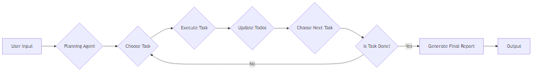

  
  <h1><b>LangCode</b></h1>
  
<b>The only CLI you'll ever need.</b>

# Deep Agent

The Deep Agent is a structured, multi-agent system for complex work. It uses a LangGraph-style architecture to execute multi-step, long-horizon tasks. The Deep Agent consists of several sub-agents, each responsible for a specific task, such as research, code generation, and Git operations.

This module implements the `create_deep_agent` function, which constructs a sophisticated "deep" agent designed to orchestrate a team of specialized sub-agents. This agent is designed to tackle complex tasks that demand both in-depth research and precise code implementation. The Deep Agent excels at problems that are beyond the capabilities of simpler, single-agent systems by leveraging a hierarchical structure of sub-agents, each with specific roles and responsibilities. This design promotes modularity, scalability, and improved performance on complex tasks. The Deep Agent utilizes the ReAct framework, enabling it to reason about actions and observe their outcomes, leading to more robust and adaptive problem-solving.

## `build_deep_agent`

The `create_deep_agent` function serves as the primary constructor for the Deep Agent. It orchestrates the creation and configuration of the agent instance, setting up the necessary components and dependencies for the agent to function effectively. This function is the entry point for creating a Deep Agent and returns a LangGraph graph with planning capabilities and sub-agents. It is backward compatible, using a provided LLM or falling back to `get_model(provider)` if none is provided.

**Arguments:**
- `provider`: The Large Language Model (LLM) provider to be used for the agent's reasoning and code generation capabilities. Examples include 'anthropic' or 'gemini'. This provider is responsible for powering the agent's natural language understanding, code synthesis, and overall decision-making processes. Choosing the right provider is crucial for achieving optimal performance and aligning with specific task requirements. The `get_model` function from `..config` is used to retrieve the LLM based on the provider.
- `project_dir` (Path): The root directory for all filesystem operations performed by the agent. This parameter restricts the agent's access to the specified directory and its subdirectories, enhancing security and preventing unintended modifications outside the project scope. It ensures that the agent operates within a defined workspace, preventing accidental or malicious modifications to sensitive files or directories outside the project. This is a critical security measure for maintaining the integrity of the system. It should be a `Path` object.
- `instructions` (Optional[str]): Optional instructions to further guide the agent's behavior. These instructions are prepended to the base system prompt and can be used to tailor the agent to specific tasks or domains.
- `subagents` (Optional[List[SubAgent]]): A list of `SubAgent` objects that the Deep Agent can delegate tasks to. Each sub-agent has its own set of tools and instructions, allowing the Deep Agent to leverage specialized expertise for different aspects of a complex problem.
- `apply` (bool): A boolean flag that, when set to `True`, allows the agent to execute filesystem modifications and shell commands without requiring explicit user confirmation. This is useful for automated workflows but should be used with caution. When `apply` is set to `True`, the agent will automatically apply changes to the filesystem and execute shell commands without requiring manual intervention. This can significantly speed up the development process, but it also introduces the risk of unintended consequences. Therefore, it is crucial to carefully consider the implications before enabling this flag.
- `test_cmd` (Optional[str]): An optional command that the agent can use to verify its changes. This command is executed using the `run_cmd` tool, and the agent will analyze the output to determine if the changes were successful. The `{TEST_CMD}` placeholder in prompts will be replaced with this value. This allows the agent to automatically validate its modifications by running a predefined test suite or a specific test case. The agent will parse the output of the test command to determine if the changes have introduced any regressions or errors. This is a crucial step for ensuring the quality and reliability of the implemented code.
- `state_schema`: The schema for the agent's state. Defaults to `DeepAgentState`.
- `checkpointer`: An optional checkpointer for the LangGraph graph.
- `llm`: An optional pre-configured LLM. If provided, it will be used instead of creating a new LLM from the `provider` argument. This allows for more control over the LLM configuration.

The `create_deep_agent` function serves as the primary constructor for the Deep Agent. It orchestrates the creation and configuration of the agent instance, setting up the necessary components and dependencies for the agent to function effectively. This function is the entry point for creating a Deep Agent and returns a LangGraph graph with planning capabilities and sub-agents. It is backward compatible, using a provided LLM or falling back to `get_model(provider)` if none is provided.

**Arguments:**
- `provider`: The Large Language Model (LLM) provider to be used for the agent's reasoning and code generation capabilities. Examples include 'anthropic' or 'gemini'. This provider is responsible for powering the agent's natural language understanding, code synthesis, and overall decision-making processes. Choosing the right provider is crucial for achieving optimal performance and aligning with specific task requirements. The `get_model` function from `..config` is used to retrieve the LLM based on the provider.
- `project_dir` (Path): The root directory for all filesystem operations performed by the agent. This parameter restricts the agent's access to the specified directory and its subdirectories, enhancing security and preventing unintended modifications outside the project scope. It ensures that the agent operates within a defined workspace, preventing accidental or malicious modifications to sensitive files or directories outside the project. This is a critical security measure for maintaining the integrity of the system. It should be a `Path` object.
- `instructions` (Optional[str]): Optional instructions to further guide the agent's behavior. These instructions are prepended to the base system prompt and can be used to tailor the agent to specific tasks or domains.
- `subagents` (Optional[List[SubAgent]]): A list of `SubAgent` objects that the Deep Agent can delegate tasks to. Each sub-agent has its own set of tools and instructions, allowing the Deep Agent to leverage specialized expertise for different aspects of a complex problem.
- `apply` (bool): A boolean flag that, when set to `True`, allows the agent to execute filesystem modifications and shell commands without requiring explicit user confirmation. This is useful for automated workflows but should be used with caution. When `apply` is set to `True`, the agent will automatically apply changes to the filesystem and execute shell commands without requiring manual intervention. This can significantly speed up the development process, but it also introduces the risk of unintended consequences. Therefore, it is crucial to carefully consider the implications before enabling this flag.
- `test_cmd` (Optional[str]): An optional command that the agent can use to verify its changes. This command is executed using the `run_cmd` tool, and the agent will analyze the output to determine if the changes were successful. The `{TEST_CMD}` placeholder in prompts will be replaced with this value. This allows the agent to automatically validate its modifications by running a predefined test suite or a specific test case. The agent will parse the output of the test command to determine if the changes have introduced any regressions or errors. This is a crucial step for ensuring the quality and reliability of the implemented code.
- `state_schema`: The schema for the agent's state. Defaults to `DeepAgentState`.
- `checkpointer`: An optional checkpointer for the LangGraph graph.
- `llm`: An optional pre-configured LLM. If provided, it will be used instead of creating a new LLM from the `provider` argument. This allows for more control over the LLM configuration.

### Sub-agents

The deep agent is composed of two primary sub-agents, each with distinct responsibilities and capabilities:

1. **Researcher:** This sub-agent is responsible for conducting comprehensive web research using the `TavilySearch` tool and interacting with the Model Context Protocol (MCP) via available MCP tools. MCP is an open standard, open-source framework that standardizes the way AI systems like large language models (LLMs) integrate and share data with external tools, systems, and data sources. The Researcher gathers information from the internet and manages resources within the MCP environment, providing the Deep Agent with the necessary context and information for informed decision-making. The Researcher leverages tools like `TavilySearch` to perform targeted searches based on the task at hand and extracts relevant information from the search results. It also uses MCP tools to query and manipulate data within the MCP, enabling the Deep Agent to access and utilize information from various sources.

2. **Coder:** This sub-agent is responsible for all code-related tasks, including reading, writing, and modifying code, as well as running tests to ensure the quality and correctness of the implemented code. It has access to the local filesystem, allowing it to read and write code files, and shell tools, which enable it to execute commands and interact with the operating system. The Coder sub-agent is the primary executor of code-related tasks within the Deep Agent and uses tools like `make_edit_by_diff_tool`, `make_write_file_tool`, and `make_run_cmd_tool` to implement code changes and verify their correctness. It also uses tools like `make_process_multimodal_tool` to process multimodal data and integrate it into the codebase.

The deep agent is composed of two primary sub-agents, each with distinct responsibilities and capabilities:

1. **Researcher:** This sub-agent is responsible for conducting comprehensive web research using the `TavilySearch` tool and interacting with the Model Context Protocol (MCP) via available MCP tools. MCP is an open standard, open-source framework that standardizes the way AI systems like large language models (LLMs) integrate and share data with external tools, systems, and data sources. The Researcher gathers information from the internet and manages resources within the MCP environment, providing the Deep Agent with the necessary context and information for informed decision-making. The Researcher leverages tools like `TavilySearch` to perform targeted searches based on the task at hand and extracts relevant information from the search results. It also uses MCP tools to query and manipulate data within the MCP, enabling the Deep Agent to access and utilize information from various sources.

2. **Coder:** This sub-agent is responsible for all code-related tasks, including reading, writing, and modifying code, as well as running tests to ensure the quality and correctness of the implemented code. It has access to the local filesystem, allowing it to read and write code files, and shell tools, which enable it to execute commands and interact with the operating system. The Coder sub-agent is the primary executor of code-related tasks within the Deep Agent and uses tools like `make_edit_by_diff_tool`, `make_write_file_tool`, and `make_run_cmd_tool` to implement code changes and verify their correctness. It also uses tools like `make_process_multimodal_tool` to process multimodal data and integrate it into the codebase.

### Agent Construction

The `create_deep_agent` function constructs the Deep Agent through the following steps:

1. **Tool Assembly:** The function assembles a comprehensive list of tools, including filesystem tools (`make_glob_tool`, `make_grep_tool`, `make_list_dir_tool`, `make_read_file_tool`, `make_edit_by_diff_tool`, `make_write_file_tool`, `make_delete_file_tool`), shell tools (`make_run_cmd_tool`), external tools like `TavilySearch` and MCP tools (obtained via `get_mcp_tools`), processing tools (`make_process_multimodal_tool`), and Mermaid tools (`make_mermaid_tools`). These tools provide the agent with the ability to interact with the file system, execute shell commands, search the web, interact with the MCP, process multimodal data, and generate diagrams.

2. **Sub-agent Definition:** The `researcher` and `coder` sub-agents are defined with their respective tools and prompts. The prompts guide the sub-agents' behavior and define their roles within the Deep Agent.

3. **Prompt Construction:** A main prompt is constructed for the Deep Agent. This prompt combines the `BASE_SYSTEM` prompt, any provided `instructions` via the `instruction_seed`, the `BASE_DEEP_SUFFIX`, and the project context loaded from `.langcode/langcode.md` using `load_langcode_context`. This combined prompt provides the Deep Agent with the necessary context and instructions to perform its tasks effectively.

4. **Agent Creation:** The `create_react_agent` function from the `langgraph.prebuilt` library is used to create the final agent. This function takes the LLM (`model`), the combined prompt, the assembled tools, the state schema (`state_schema`), and an optional checkpointer as input. The resulting agent is a LangGraph graph that can be executed to perform complex tasks. The `recursion_limit` is set to 70 to prevent infinite loops.

The `create_deep_agent` function constructs the Deep Agent through the following steps:

1. **Tool Assembly:** The function assembles a comprehensive list of tools, including filesystem tools (`make_glob_tool`, `make_grep_tool`, `make_list_dir_tool`, `make_read_file_tool`, `make_edit_by_diff_tool`, `make_write_file_tool`, `make_delete_file_tool`), shell tools (`make_run_cmd_tool`), external tools like `TavilySearch` and MCP tools (obtained via `get_mcp_tools`), processing tools (`make_process_multimodal_tool`), and Mermaid tools (`make_mermaid_tools`). These tools provide the agent with the ability to interact with the file system, execute shell commands, search the web, interact with the MCP, process multimodal data, and generate diagrams.

2. **Sub-agent Definition:** The `researcher` and `coder` sub-agents are defined with their respective tools and prompts. The prompts guide the sub-agents' behavior and define their roles within the Deep Agent.

3. **Prompt Construction:** A main prompt is constructed for the Deep Agent. This prompt combines the `BASE_SYSTEM` prompt, any provided `instructions` via the `instruction_seed`, the `BASE_DEEP_SUFFIX`, and the project context loaded from `.langcode/langcode.md` using `load_langcode_context`. This combined prompt provides the Deep Agent with the necessary context and instructions to perform its tasks effectively.

4. **Agent Creation:** The `create_react_agent` function from the `langgraph.prebuilt` library is used to create the final agent. This function takes the LLM (`model`), the combined prompt, the assembled tools, the state schema (`state_schema`), and an optional checkpointer as input. The resulting agent is a LangGraph graph that can be executed to perform complex tasks. The `recursion_limit` is set to 70 to prevent infinite loops.
