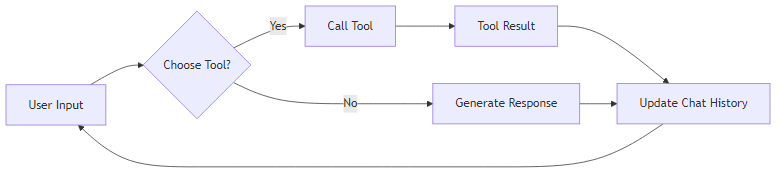

  
  <h1><b>LangCode</b></h1>
  
<b>The only CLI you need.</b>

# ReAct Agent

The ReAct Agent is a fast loop for chat, reads, and targeted edits. It follows the ReAct (Reasoning and Acting) framework, where the agent reasons about the current state, decides on an action, and then observes the result of that action. This process is repeated until the agent reaches a conclusion or the maximum number of iterations is reached.

This module provides an implementation of a coding agent based on the ReAct (Reasoning and Acting) framework. The `build_react_agent` function constructs an `AgentExecutor` that embodies the ReAct agent. The ReAct agent is designed to interact with its environment by interleaving reasoning steps with action execution. This allows the agent to dynamically adjust its strategy based on observations and feedback from the environment, leading to more adaptive and effective problem-solving. The ReAct framework combines the strengths of both reasoning and acting, enabling the agent to not only plan and strategize but also to execute actions and learn from the results. The agent leverages tool calling to interact with its environment.

## `build_prompt`

The `build_prompt` function constructs the primary prompt used to guide the ReAct agent. The prompt begins with a foundational system message (`BASE_SYSTEM`) that sets the overall context and goals for the agent. It also incorporates an optional `instruction_seed` to specialize the agent's behavior for specific workflows, such as feature implementation or bug fixing. The `instruction_seed` allows for fine-tuning the agent's reasoning and action selection processes to better suit the demands of a particular task. The prompt is formatted as a `ChatPromptTemplate` and includes placeholders for chat history and agent scratchpad.

Includes the following key placeholders:
- `chat_history`: Represents the conversation history between the user and the agent. This history provides crucial context for the current interaction, allowing the agent to understand the user's intentions, track previous actions, and maintain a coherent dialogue. The `chat_history` placeholder is dynamically updated as the conversation progresses, ensuring that the agent always has access to the most relevant information.
- `input`: Contains the user's current query or instruction, which the agent must process and respond to.
- `agent_scratchpad`: Serves as a temporary workspace for the agent to store intermediate reasoning steps, observations, and action plans. This scratchpad allows the agent to break down complex tasks into smaller, more manageable steps, and to keep track of its progress as it works towards a solution. The `agent_scratchpad` is a critical component of the ReAct framework, enabling the agent to reason more effectively and to adapt its strategy based on its observations.

The `build_prompt` function constructs the primary prompt used to guide the ReAct agent. The prompt begins with a foundational system message (`BASE_SYSTEM`) that sets the overall context and goals for the agent. It also incorporates an optional `instruction_seed` to specialize the agent's behavior for specific workflows, such as feature implementation or bug fixing. The `instruction_seed` allows for fine-tuning the agent's reasoning and action selection processes to better suit the demands of a particular task. The prompt is formatted as a `ChatPromptTemplate` and includes placeholders for chat history and agent scratchpad.

Includes the following key placeholders:
- `chat_history`: Represents the conversation history between the user and the agent. This history provides crucial context for the current interaction, allowing the agent to understand the user's intentions, track previous actions, and maintain a coherent dialogue. The `chat_history` placeholder is dynamically updated as the conversation progresses, ensuring that the agent always has access to the most relevant information.
- `input`: Contains the user's current query or instruction, which the agent must process and respond to.
- `agent_scratchpad`: Serves as a temporary workspace for the agent to store intermediate reasoning steps, observations, and action plans. This scratchpad allows the agent to break down complex tasks into smaller, more manageable steps, and to keep track of its progress as it works towards a solution. The `agent_scratchpad` is a critical component of the ReAct framework, enabling the agent to reason more effectively and to adapt its strategy based on its observations.

## `build_react_agent`

The `build_react_agent` function is the main factory function responsible for constructing the `AgentExecutor`. The `AgentExecutor` orchestrates the interaction between the agent and its environment, managing the flow of information and actions between the agent and the available tools. This function configures the agent with the necessary tools, prompt, and LLM provider, setting up the agent for effective problem-solving. It leverages the `create_tool_calling_agent` function from `langchain.agents` to create the agent and then configures the `AgentExecutor` with various parameters to control its behavior.

**Arguments:**
- `provider` (str): Specifies the Large Language Model (LLM) provider to be used for the agent's reasoning and code generation. Supported providers include `anthropic` and `gemini`. The LLM provider is the engine that powers the agent's ability to understand natural language, generate code, and make decisions. Choosing the right LLM provider is crucial for achieving optimal performance and aligning with specific task requirements. The `get_model` function from `..config` is used to retrieve the LLM based on the provider.
- `project_dir` (Path): Defines the root directory for all filesystem operations performed by the agent. This parameter limits the agent's access to the specified directory and its subdirectories, enhancing security and preventing unintended modifications outside the project's boundaries. By restricting the agent's file system access, this parameter helps to prevent accidental or malicious modifications to sensitive files or directories outside of the designated project area. This is a critical security measure for maintaining the integrity of the system. It should be a `Path` object.
- `apply` (bool): A boolean flag. When set to `True`, the agent is permitted to modify files and execute shell commands without requiring explicit user approval. This setting is suitable for automated workflows but should be enabled with caution due to the potential for unintended consequences. When `apply` is enabled, the agent will automatically apply changes to the file system and execute shell commands without requiring human intervention. This can significantly accelerate the development process, but it also introduces the risk of unintended or undesirable actions. Therefore, it is essential to carefully consider the implications before enabling this flag.
- `test_cmd` (Optional[str]): An optional command, such as `pytest`, that the agent can use to validate its changes. The `{TEST_CMD}` placeholder in the agent's prompt will be replaced with the value of this argument. This allows the agent to automatically run tests after making modifications to the codebase, ensuring that the changes do not introduce any regressions or break existing functionality. The agent will analyze the output of the test command to determine if the changes have been successfully validated. This is a crucial step for maintaining the quality and stability of the codebase.
- `instruction_seed` (Optional[str]): An optional string used to specialize the agent's behavior and adapt it to specific tasks or workflows. This allows for customization of the agent's reasoning process and decision-making strategies. For example, an instruction seed could be used to guide the agent towards implementing new features, fixing bugs, or performing specific code refactoring tasks. The `instruction_seed` provides a powerful mechanism for tailoring the agent's behavior to meet the specific needs of a given project or task.
- `llm` (Optional[Any]): An optional pre-configured LLM. If provided, it will be used instead of creating a new LLM from the `provider` argument. This allows for more control over the LLM configuration.

### Tools

The agent uses a variety of tools to interact with its environment and accomplish its tasks. These tools can be broadly categorized as follows:

- **Filesystem Tools:** These tools provide the agent with the ability to interact with the file system, allowing it to read, write, and modify files. The available filesystem tools include `glob`, `grep`, `list_dir`, `read_file`, `edit_by_diff`, and `write_file`.
- **Execution Tools:** These tools allow the agent to execute shell commands and run tests. The primary execution tool is `run_cmd`.
- **Processing Tools:** These tools enable the agent to process multimodal data, such as images and text. The available processing tool is `process_multimodal`.
- **External Tools:** These tools provide the agent with access to external resources, such as the internet and the Mission Control Platform (MCP). The available external tools include `TavilySearch` (if available) and `mcp_tools`.

### Agent and Executor

The `build_react_agent` function constructs the agent and executor through the following steps:

1. **Model Retrieval:** The function retrieves the LLM using the `get_model` function from `..config`. If an `llm` is provided directly, it is used; otherwise, a new LLM is created based on the specified `provider`.
2. **Tool Assembly:** The function assembles a list of tools, including filesystem tools, execution tools, processing tools, external tools (such as `TavilySearch` and `mcp_tools`), and Mermaid tools. These tools provide the agent with the ability to interact with the file system, execute shell commands, search the web, interact with the MCP, process multimodal data, and generate diagrams.
3. **Prompt Creation:** The function creates the prompt using the `build_prompt` function, which combines the base system message, any provided instruction seed, and the project context.
4. **Agent Creation:** The function creates the agent using the `create_tool_calling_agent` function from `langchain.agents`. This function takes the LLM, the assembled tools, and the created prompt as input.
5. **Executor Creation:** The function creates the executor using the `AgentExecutor` class. The executor is configured with the agent, the tools, and various parameters to control its behavior, such as verbosity, maximum iterations, maximum execution time, and early stopping method.

The `build_react_agent` function is the main factory function responsible for constructing the `AgentExecutor`. The `AgentExecutor` orchestrates the interaction between the agent and its environment, managing the flow of information and actions between the agent and the available tools. This function configures the agent with the necessary tools, prompt, and LLM provider, setting up the agent for effective problem-solving. It leverages the `create_tool_calling_agent` function from `langchain.agents` to create the agent and then configures the `AgentExecutor` with various parameters to control its behavior.

**Arguments:**
- `provider` (str): Specifies the Large Language Model (LLM) provider to be used for the agent's reasoning and code generation. Supported providers include `anthropic` and `gemini`. The LLM provider is the engine that powers the agent's ability to understand natural language, generate code, and make decisions. Choosing the right LLM provider is crucial for achieving optimal performance and aligning with specific task requirements. The `get_model` function from `..config` is used to retrieve the LLM based on the provider.
- `project_dir` (Path): Defines the root directory for all filesystem operations performed by the agent. This parameter limits the agent's access to the specified directory and its subdirectories, enhancing security and preventing unintended modifications outside the project's boundaries. By restricting the agent's file system access, this parameter helps to prevent accidental or malicious modifications to sensitive files or directories outside of the designated project area. This is a critical security measure for maintaining the integrity of the system. It should be a `Path` object.
- `apply` (bool): A boolean flag. When set to `True`, the agent is permitted to modify files and execute shell commands without requiring explicit user approval. This setting is suitable for automated workflows but should be enabled with caution due to the potential for unintended consequences. When `apply` is enabled, the agent will automatically apply changes to the file system and execute shell commands without requiring human intervention. This can significantly accelerate the development process, but it also introduces the risk of unintended or undesirable actions. Therefore, it is essential to carefully consider the implications before enabling this flag.
- `test_cmd` (Optional[str]): An optional command, such as `pytest`, that the agent can use to validate its changes. The `{TEST_CMD}` placeholder in the agent's prompt will be replaced with the value of this argument. This allows the agent to automatically run tests after making modifications to the codebase, ensuring that the changes do not introduce any regressions or break existing functionality. The agent will analyze the output of the test command to determine if the changes have been successfully validated. This is a crucial step for maintaining the quality and stability of the codebase.
- `instruction_seed` (Optional[str]): An optional string used to specialize the agent's behavior and adapt it to specific tasks or workflows. This allows for customization of the agent's reasoning process and decision-making strategies. For example, an instruction seed could be used to guide the agent towards implementing new features, fixing bugs, or performing specific code refactoring tasks. The `instruction_seed` provides a powerful mechanism for tailoring the agent's behavior to meet the specific needs of a given project or task.
- `llm` (Optional[Any]): An optional pre-configured LLM. If provided, it will be used instead of creating a new LLM from the `provider` argument. This allows for more control over the LLM configuration.

### Tools

The agent uses a variety of tools to interact with its environment and accomplish its tasks. These tools can be broadly categorized as follows:

- **Filesystem Tools:** These tools provide the agent with the ability to interact with the file system, allowing it to read, write, and modify files. The available filesystem tools include `glob`, `grep`, `list_dir`, `read_file`, `edit_by_diff`, and `write_file`.
- **Execution Tools:** These tools allow the agent to execute shell commands and run tests. The primary execution tool is `run_cmd`.
- **Processing Tools:** These tools enable the agent to process multimodal data, such as images and text. The available processing tool is `process_multimodal`.
- **External Tools:** These tools provide the agent with access to external resources, such as the internet and the Mission Control Platform (MCP). The available external tools include `TavilySearch` (if available) and `mcp_tools`.

### Agent and Executor

The `build_react_agent` function constructs the agent and executor through the following steps:

1. **Model Retrieval:** The function retrieves the LLM using the `get_model` function from `..config`. If an `llm` is provided directly, it is used; otherwise, a new LLM is created based on the specified `provider`.
2. **Tool Assembly:** The function assembles a list of tools, including filesystem tools, execution tools, processing tools, external tools (such as `TavilySearch` and `mcp_tools`), and Mermaid tools. These tools provide the agent with the ability to interact with the file system, execute shell commands, search the web, interact with the MCP, process multimodal data, and generate diagrams.
3. **Prompt Creation:** The function creates the prompt using the `build_prompt` function, which combines the base system message, any provided instruction seed, and the project context.
4. **Agent Creation:** The function creates the agent using the `create_tool_calling_agent` function from `langchain.agents`. This function takes the LLM, the assembled tools, and the created prompt as input.
5. **Executor Creation:** The function creates the executor using the `AgentExecutor` class. The executor is configured with the agent, the tools, and various parameters to control its behavior, such as verbosity, maximum iterations, maximum execution time, and early stopping method.
