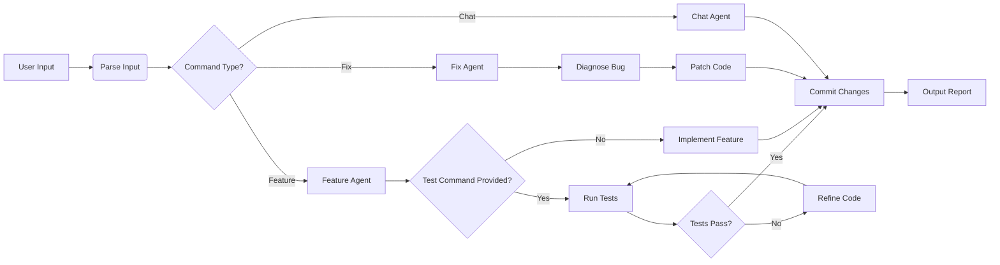

```mermaid
graph LR
    A[User Input] --> B(Parse Input)
    B --> C{Command Type?}
    C -- Chat --> D[Chat Agent]
    C -- Feature --> E[Feature Agent]
    C -- Fix --> F[Fix Agent]
    E --> G{Test Command Provided?}
    G -- Yes --> H[Run Tests]
    G -- No --> I[Implement Feature]
    F --> J[Diagnose Bug]
    J --> K[Patch Code]
    H --> L{Tests Pass?}
    L -- Yes --> M[Commit Changes]
    L -- No --> N[Refine Code]
    N --> H
    I --> M
    K --> M
    D --> M
    M --> O[Output Report]
```