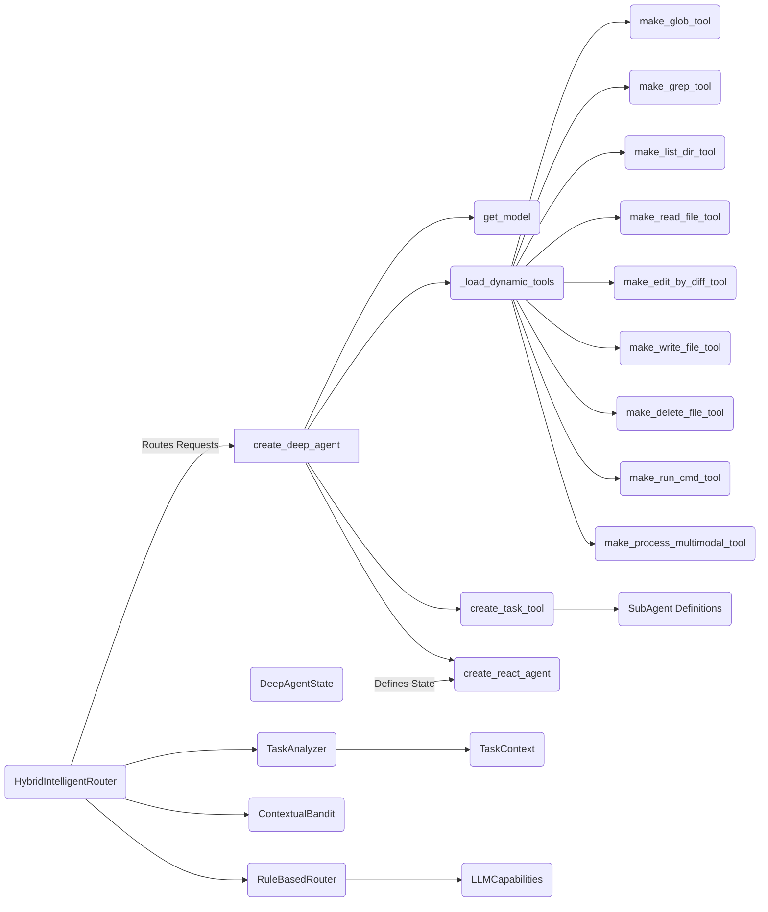

```mermaid
graph LR
    A[create_deep_agent] --> B(get_model);
    A --> C(_load_dynamic_tools);
    C --> D(make_glob_tool);
    C --> E(make_grep_tool);
    C --> F(make_list_dir_tool);
    C --> G(make_read_file_tool);
    C --> H(make_edit_by_diff_tool);
    C --> I(make_write_file_tool);
    C --> J(make_delete_file_tool);
    C --> K(make_run_cmd_tool);
    C --> L(make_process_multimodal_tool);
    A --> M(create_task_tool);
    M --> N(SubAgent Definitions);
    A --> O(create_react_agent);
    P(DeepAgentState) -- Defines State --> O;
    Q(HybridIntelligentRouter) -- Routes Requests --> A;
    Q --> R(TaskAnalyzer);
    R --> S(TaskContext);
    Q --> T(ContextualBandit);
    Q --> U(RuleBasedRouter);
    U --> V(LLMCapabilities);
```